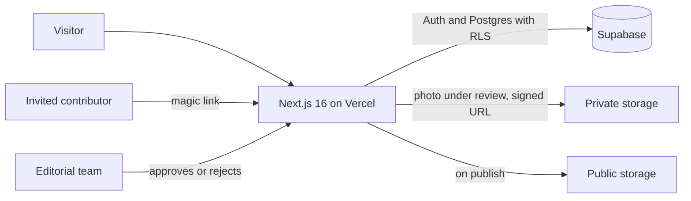

# Dwell Havana

**A digital editorial magazine about architecture, interiors and homes in Havana**, with contributions from invited contributors and human moderation before anything is published.

**[View the demo →](https://dwell-havanna.vercel.app)** · Client project, built by [GallaDev](https://github.com/GallaGit). The demo content (photos and text) is placeholder.

<p>
  
</p>
<p>
  
  
</p>

## Features

- **Human-reviewed publishing:** every submission goes into a queue and is only published once the editorial team approves it.
- **Invite-only contributors:** sign-in with Supabase Auth magic links, no open sign-up.
- **Protected photos:** submissions are stored in a private bucket with 15-minute signed URLs; EXIF metadata is stripped and, once published, the photo moves to a public bucket.
- **Security:** forced RLS on every table, rate limiting on submissions, and CSP, HSTS and COOP headers.
- **Performance:** public pages are prerendered (static or one-hour ISR) and photos are resized in the browser before upload.

## How it works



## Stack

Next.js 16 (App Router), React 19, TypeScript, Tailwind CSS 4 and Supabase (Auth, Postgres and Storage).

## Scripts

```bash
npm run dev      # development
npm run lint     # eslint
npm test         # node:test; the HTTP E2E test is skipped without E2E_* variables
npm run build    # production build; no Supabase secrets required
npm run start    # serves the build
```

Copy `.env.example` to `.env.local`. Never commit secrets. The contact email is `NEXT_PUBLIC_CONTACT_EMAIL`; if it is missing, the site shows `hola@dwellhavana.example`.

Public pages are prerendered (static or one-hour ISR). Sign-in, `/admin/review`, `POST /api/submissions` and `/auth/callback` stay dynamic.

To list the canonical SQL without applying it:

```bash
scripts/apply-canonical-sql.sh
```

## Documentation

The canonical documentation (in Spanish) lives in [`docs/README.md`](docs/README.md). The Supabase status as of 2026-09-25 is in [`docs/Tech/08-estado-supabase-2026-09-25.md`](docs/Tech/08-estado-supabase-2026-09-25.md). Local Lighthouse results and placeholder content are covered in [`docs/Tech/07-rendimiento.md`](docs/Tech/07-rendimiento.md) and [`docs/PRODUCT/contenido-placeholder.md`](docs/PRODUCT/contenido-placeholder.md). What remains before launch is Step 2 of [`docs/PRODUCT/roadmap.md`](docs/PRODUCT/roadmap.md).
