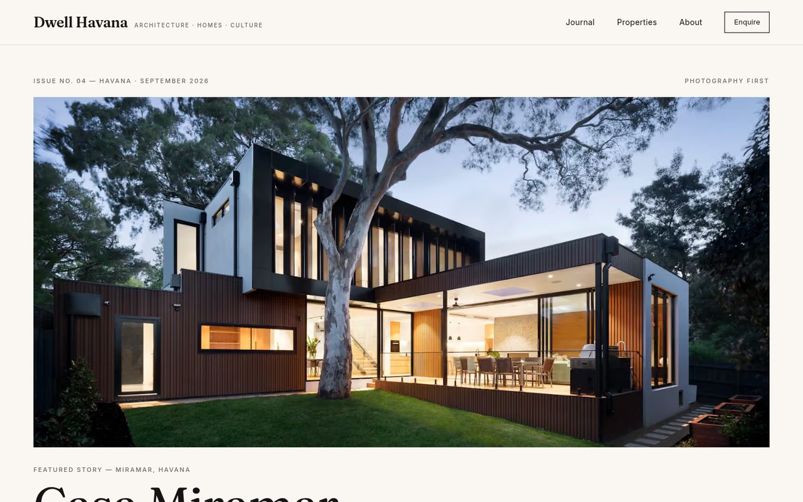
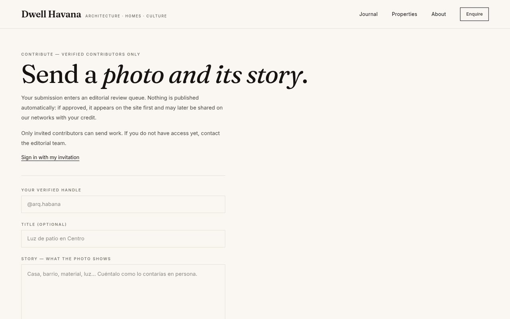
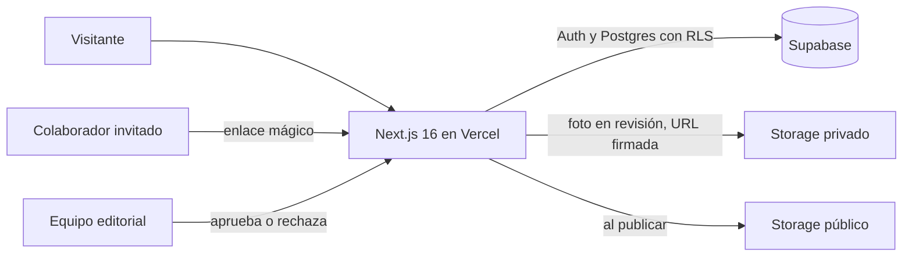

# Dwell Havana

**Revista editorial digital sobre arquitectura, interiores y casas de La Habana**, con aportaciones de colaboradores invitados y moderación humana antes de publicar.

**[Ver la demo →](https://dwell-havanna.vercel.app)** · Proyecto para cliente, desarrollado por [GallaDev](https://github.com/GallaGit). El contenido de la demo (fotos y textos) es provisional.

<p>
  
</p>
<p>
  
  
</p>

> **EN:** Editorial web magazine about Havana architecture and homes. Invited contributors submit photos and stories; nothing goes live without human review. Built with Next.js 16, React 19, TypeScript, Tailwind CSS 4 and Supabase (Auth, Postgres with RLS, Storage), deployed on Vercel.

## Qué hace

- **Publicación con revisión humana:** cada envío entra en una cola y solo se publica si el equipo editorial lo aprueba.
- **Colaboradores por invitación:** acceso con enlace mágico de Supabase Auth, sin registro abierto.
- **Fotos protegidas:** los envíos se guardan en un bucket privado con URLs firmadas de 15 minutos; se eliminan sus metadatos EXIF y, al publicar, la foto pasa a un bucket público.
- **Seguridad:** RLS forzado en todas las tablas, límite de ritmo en los envíos, cabeceras CSP, HSTS y COOP.
- **Rendimiento:** páginas públicas prerenderizadas (estáticas o ISR de una hora) y fotos reducidas en el navegador antes de subir.

## Cómo funciona



## Stack

Next.js 16 (App Router), React 19, TypeScript, Tailwind CSS 4 y Supabase (Auth, Postgres y Storage).

## Scripts

```bash
npm run dev      # desarrollo
npm run lint     # eslint
npm test         # node:test; el E2E HTTP se omite sin variables E2E_*
npm run build    # build de producción; no requiere secretos de Supabase
npm run start    # sirve el build
```

Copia `.env.example` a `.env.local`. No commitees secretos. El email de contacto es `NEXT_PUBLIC_CONTACT_EMAIL`. Si falta, el sitio muestra `hola@dwellhavana.example`.

Las páginas públicas se prerenderizan (estáticas o ISR de una hora). El login, `/admin/review`, `POST /api/submissions` y `/auth/callback` siguen dinámicos.

Para listar el SQL canónico sin aplicarlo:

```bash
scripts/apply-canonical-sql.sh
```

## Documentación

La documentación canónica está en [`docs/README.md`](docs/README.md). El estado de Supabase al 2026-09-25 está en [`docs/Tech/08-estado-supabase-2026-09-25.md`](docs/Tech/08-estado-supabase-2026-09-25.md). Lighthouse local y los placeholders están en [`docs/Tech/07-rendimiento.md`](docs/Tech/07-rendimiento.md) y [`docs/PRODUCT/contenido-placeholder.md`](docs/PRODUCT/contenido-placeholder.md). Lo que queda para el lanzamiento es el Paso 2 de [`docs/PRODUCT/roadmap.md`](docs/PRODUCT/roadmap.md).
